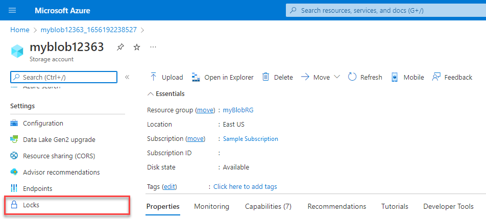
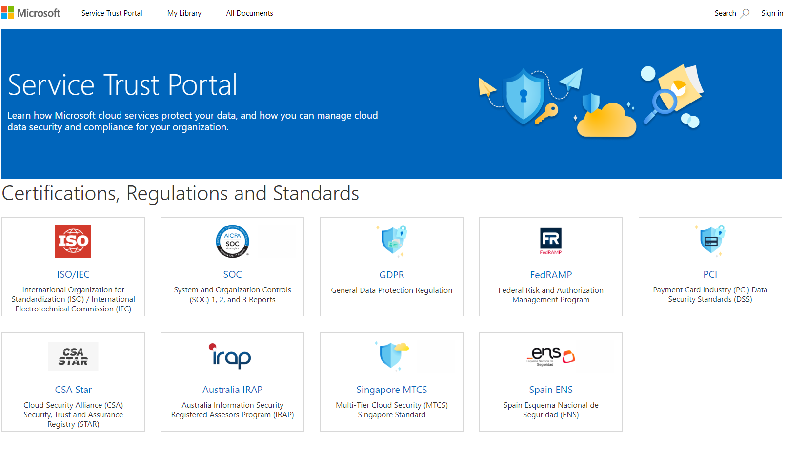
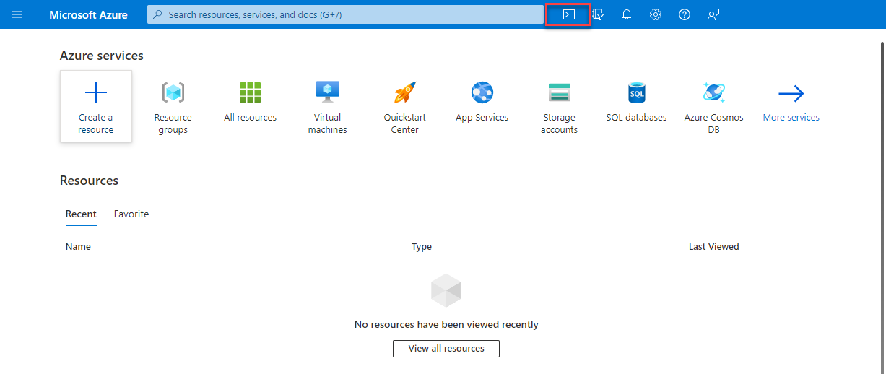
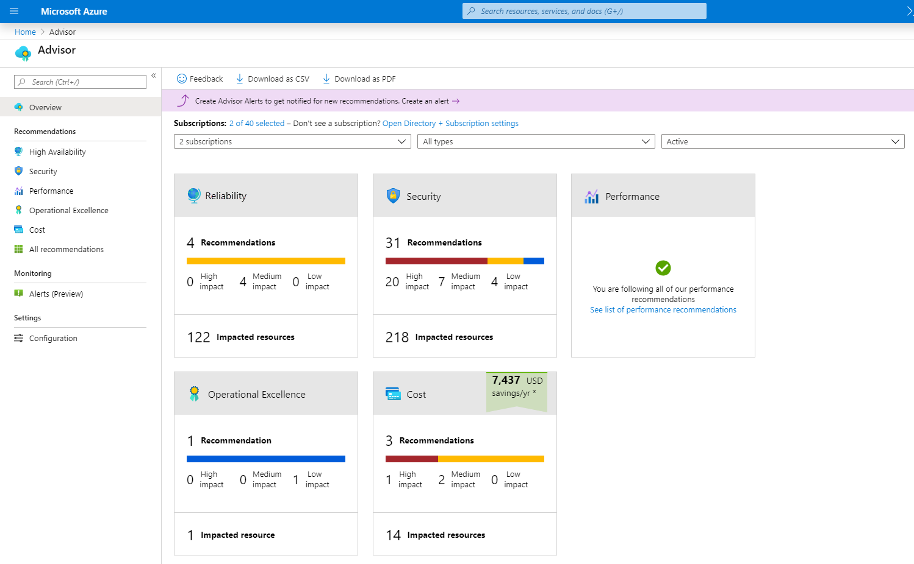
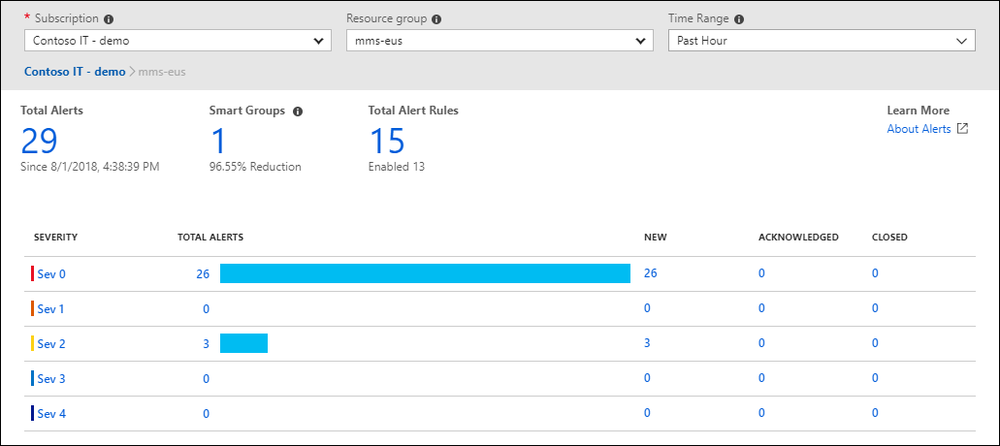

## Describe Cost Management in Azure

### Describe factors that can affect costs in Azure

- **Resource type**
  - A number of factors influence the cost of Azure resources. The type of resources, the settings for the resource, and the Azure region will all have an impact on how much a resource costs. 

- **Consumption**
  - Pay-as-you-go has been a consistent theme throughout, and that’s the cloud payment model where you pay for the resources that you use during a billing cycle.
  - When you reserve capacity, you’re committing to using and paying for a certain amount of Azure resources during a given period (typically one or three years). 

- **Maintenance**

- **Geography**
  - With this global deployment comes global pricing differences. The cost of power, labor, taxes, and fees vary depending on the location.

- **Network Traffic**
  - Billing zones are a factor in determining the cost of some Azure services.
  - Bandwidth refers to data moving in and out of Azure datacenters. 
  - Some inbound data transfers (data going into Azure datacenters) are free. For outbound data transfers (data leaving Azure datacenters), data transfer pricing is based on zones.
  - https://azure.microsoft.com/en-us/pricing/details/bandwidth/

- **Subscription type**
  - Some Azure subscription types also include usage allowances, which affect costs.

- **Azure Marketplace**
  - Azure Marketplace lets you purchase Azure-based solutions and services from third-party vendors.
  - https://learn.microsoft.com/en-us/legal/marketplace/certification-policies

---

### Compare the Pricing and Total Cost of Ownership calculators

- The pricing calculator and the total cost of ownership (TCO) calculator are two calculators that help you understand potential Azure expenses.

- **Pricing calculator**
  - The pricing calculator is designed to give you an estimated cost for provisioning resources in Azure.
  - 

- **TCO calculator**
  - The TCO calculator is designed to help you compare the costs for running an on-premises infrastructure compared to an Azure Cloud infrastructure.
  - With the TCO calculator, you enter your configuration, add in assumptions like power and IT labor costs, and are presented with an estimation of the cost difference to run the same environment in your current datacenter or in Azure.
  - 
  
- The Pricing calculator is for information purposes only. The prices are only an estimate, and you won't be charged for any services you select.
- https://azure.microsoft.com/en-us/pricing/calculator/

---

### Describe the Microsoft Cost Management tool

- Cost Management provides the ability to quickly check Azure resource costs, create alerts based on resource spend, and create budgets that can be used to automate management of resources.
- 

- **Cost alerts** provide a single location to quickly check on all of the different alert types that may show up in the Cost Management service. The three types of alerts that may show up are:

  - **Budget alerts**
    - Budget alerts notify you when spending, based on usage or cost, reaches or exceeds the amount defined in the alert condition of the budget.
    - In the Azure portal, budgets are defined by cost. 
    - Budgets are defined by cost or by consumption usage when using the Azure Consumption API. 
    - Budget alerts support both cost-based and usage-based budgets.

  - **Credit alerts**
    - Credit alerts notify you when your Azure credit monetary commitments are consumed. 
    - Monetary commitments are for organizations with Enterprise Agreements (EAs). 
    - Credit alerts are generated automatically at 90% and at 100% of your Azure credit balance. 

  - **Department spending quota alerts**
    - Department spending quota alerts notify you when department spending reaches a fixed threshold of the quota. 
    - Spending quotas are configured in the EA portal. 

- A **budget** is where you set a spending limit for Azure. You can set budgets based on a subscription, resource group, service type, or other criteria. 
  - When you set a budget, you will also set a budget alert. 

---

### Describe the purpose of tags

- Resource tags are another way to organize resources. Tags provide extra information, or metadata, about your resources. This metadata is useful for:

  - **Resource management** – Tags enable you to locate and act on resources that are associated with specific workloads, environments, business units, and owners.
  - **Cost management and optimization** – Tags enable you to group resources so that you can report on costs, allocate internal cost centers, track budgets, and forecast estimated cost.
  - **Operations management** – Tags enable you to group resources according to how critical their availability is to your business. This grouping helps you formulate service-level agreements (SLAs).
  - **Security** – Tags enable you to classify data by its security level, such as public or confidential.
  - **Governance and regulatory compliance** – Tags enable you to identify resources that align with governance or regulatory compliance requirements, such as ISO 27001. Tags can also be part of your standards enforcement efforts.
  - **Workload optimization and automation** – Tags can help you visualize all of the resources that participate in complex deployments. You might tag a resource with its associated workload or application name and use Azure DevOps to perform automated tasks on those resources.

- You can add, modify, or delete resource tags through:
  - Windows PowerShell
  - The Azure CLI
  - Azure Resource Manager templates
  - The REST API
  - The Azure portal

- You can use **Azure Policy** to enforce tagging rules and conventions.
  - For example, you can require that certain tags be added to new resources as they're provisioned.
- 

## Describe features and tools in Azure for governance and compliance

### Describe the purpose of Microsoft Purview

- **Microsoft Purview** is a family of data governance, risk, and compliance solutions that helps you get a single, unified view into your data. Microsoft Purview brings insights about your on-premises, multicloud, and software-as-a-service data together.

- Two main solution areas comprise Microsoft Purview:

  - **Risk and compliance**
    - Microsoft 365 features as a core component of the Microsoft Purview risk and compliance solutions.
    - Microsoft Purview, by managing and monitoring your data, helps your organization:
      - Protect sensitive data across clouds, apps, and devices.
      - Identify data risks and manage regulatory compliance requirements.
      - Get started with regulatory compliance.

  - **Unified data governance**
    - Microsoft Purview’s robust data governance capabilities enable you to manage your data stored in Azure, SQL and Hive databases, locally, and in other clouds like Amazon S3.
    - Microsoft Purview’s unified data governance helps your organization:
      - Create an up-to-date map of your entire data estate that includes data classification and end-to-end lineage.
      - Identify where sensitive data is stored in your estate.
      - Create a secure environment for data consumers to find valuable data.
      - Generate insights about how your data is stored and used.
      - Manage access to the data in your estate securely and at scale.

---

### Describe the purpose of Azure Policy

- **Azure Policy** is a service in Azure that enables you to create, assign, and manage policies that control or audit your resources.
- Azure Policy comes with built-in policy and initiative definitions for Storage, Networking, Compute, Security Center, and Monitoring.
- In some cases, Azure Policy can automatically remediate noncompliant resources and configurations to ensure the integrity of the state of the resources.
- Azure Policy also integrates with Azure DevOps by applying any continuous integration and delivery pipeline policies that pertain to the pre-deployment and post-deployment phases of your applications.

#### Azure Policy Initiatives

- An **Azure Policy initiative** is a way of grouping related policies together. 
- Under this initiative, the following policy definitions are included:
  - **Monitor unencrypted SQL Database in Security Center**: Monitors for unencrypted SQL databases and servers.
  - **Monitor OS vulnerabilities in Security Center**: Monitors servers that don't satisfy the configured OS vulnerability baseline.
  - **Monitor missing Endpoint Protection in Security Center**: Monitors for servers that don't have an installed endpoint protection agent.

---

### Describe the purpose of Resource Locks

- A **resource lock** prevents resources from being accidentally deleted or changed.
- Resource locks can be applied to individual resources, resource groups, or even an entire subscription.
- Resource locks are inherited — a lock on a resource group applies to all resources within that group.

#### Types of Resource Locks

- **Delete**: Authorized users can read and modify a resource, but cannot delete it.
- **ReadOnly**: Authorized users can read a resource, but cannot delete or update it.

- Resource locks can be managed from:
  - The Azure portal
  - PowerShell
  - Azure CLI
  - Azure Resource Manager template
  - 

#### Modifying a Locked Resource

- To modify a locked resource, you must first **remove the lock**.
- Once the lock is removed, you can perform any action you have permission for.
- Resource locks **apply regardless of RBAC permissions**.

---

### Describe the purpose of the Service Trust Portal

- The **Microsoft Service Trust Portal** is a portal that provides access to content, tools, and resources about Microsoft security, privacy, and compliance practices.
- It includes details about Microsoft's implementation of controls and processes that protect cloud services and customer data.

- 🔗 https://servicetrust.microsoft.com/
- 

#### Main Menu Features

- **Service Trust Portal**: Quick access link to the home page.
- **My Library**: Lets you save/pin documents for quick access and notifications on updates.
- **All Documents**: A central location for all documents, where you can also pin items for My Library.

- Reports and documents are available to download for **at least 12 months** after publishing or until a newer version is available.

## Describe Features and Tools for Managing and Deploying Azure Resources

### Describe Tools for Interacting with Azure

#### Azure Portal
- The **Azure portal** is a web-based, unified console that provides an alternative to command-line tools.
- With the Azure portal, you can manage your Azure subscription using a graphical user interface.

#### Azure Cloud Shell
- **Azure Cloud Shell** is a browser-based shell tool that allows you to create, configure, and manage Azure resources.
- It supports both **Azure PowerShell** and the **Azure Command Line Interface (CLI)** (Bash shell).
- Accessible via the Azure portal by selecting the Cloud Shell icon.
- 

##### Features:
- Browser-based experience — no local installation or configuration required.
- Authenticated to your Azure credentials — knows your identity and permissions.
- Supports both PowerShell and CLI (Bash), allowing you to choose your preferred environment.

#### Azure PowerShell
- A shell used by developers, DevOps, and IT professionals to run **cmdlets** that call the Azure REST API.
- Cmdlets can be run independently or combined into scripts for orchestration.
- Useful for automating management tasks in Azure.

#### Azure Command Line Interface (CLI)
- Functionally similar to Azure PowerShell but uses **Bash syntax**.
- Preferred by users who are more familiar with Bash scripting conventions.

---

### Describe the Purpose of Azure Arc

- Azure Arc uses Azure Resource Manager (ARM) to extend compliance and monitoring to hybrid and multi-cloud environments.

#### Azure Arc Enables You To:
- Project non-Azure resources into ARM to manage them centrally.
- Manage multi-cloud and hybrid:
  - Virtual machines
  - Kubernetes clusters
  - Databases
- Use familiar Azure services and management capabilities regardless of where the resources are hosted.
- Integrate traditional ITOps with DevOps practices.
- Configure custom locations on top of Azure Arc-enabled Kubernetes clusters and extensions.

#### Supported Resource Types (Outside Azure):
- Servers
- Kubernetes clusters
- Azure data services
- SQL Server
- Virtual machines (Preview)

---

### Describe Azure Resource Manager (ARM) and ARM Templates

- **Azure Resource Manager (ARM)** provides the management layer for all Azure resources.
- It authenticates, authorizes, and processes resource management requests from tools, APIs, and SDKs.

#### With ARM, You Can:
- Manage infrastructure using **declarative templates** instead of scripts.
- Deploy and manage resources as a group.
- Re-deploy environments consistently throughout the development lifecycle.
- Define resource dependencies for correct deployment order.
- Apply RBAC and tags for access control and logical organization.
- Track and analyze costs using tagged resources.

---

### Infrastructure as Code (IaC)

#### ARM Templates
- **JSON-based declarative templates** that define your infrastructure.
- Support execution of PowerShell or Bash scripts before/after deployment.

##### Key Benefits:
- **Declarative syntax**: Define what to deploy, not how to deploy.
- **Repeatable results**: Consistently deploy dev/test environments.
- **Orchestration**: ARM handles resource dependencies and parallel deployments.
- **Modular files**: Break templates into smaller components or nest them.
- **Extensibility**: Include deployment scripts within templates or reference them externally.

#### Bicep
- A **declarative language** to define Azure infrastructure using simpler syntax than JSON.

##### Bicep Advantages:
- **Support for all API versions**: Immediate use of new and preview Azure resources.
- **Simple syntax**: More readable and concise than JSON; no programming background required.
- **Repeatable results**: Idempotent deployments ensure consistent infrastructure.
- **Orchestration**: Automatically handles resource dependencies and parallelism.
- **Modularity**: Use modules to reuse and organize code efficiently.

## Describe Monitoring Tools in Azure

### Describe the Purpose of Azure Advisor

- **Azure Advisor** evaluates your Azure resources and provides recommendations to improve:
  - **Reliability**
  - **Security**
  - **Performance**
  - **Operational excellence**
  - **Cost-efficiency**

- Recommendations are accessible via the **Azure portal** and **API**, and notifications can be set up for new suggestions.

#### Recommendation Categories:
- **Reliability** – Ensures continuity for business-critical applications.
- **Security** – Detects threats and vulnerabilities that could lead to security breaches.
- **Performance** – Helps improve application speed.
- **Operational Excellence** – Enhances process efficiency, resource management, and best practices.
- **Cost** – Offers ways to optimize and reduce Azure spending.
- 

---

### Describe Azure Service Health

- **Azure Service Health** tracks the health of both your deployed resources and Azure’s global infrastructure.

#### Composed of Three Services:

1. **Azure Status**
   - Provides a **global view** of Azure service health across all regions.
   - Useful for identifying **widespread service outages**.

2. **Service Health**
   - Offers a **personalized view** focused on your Azure services and regions.
   - Communicates outages, planned maintenance, and health advisories.
   - Allows for **alerts** to be configured for service-impacting events.

3. **Resource Health**
   - Provides the **health status** of individual Azure resources.
   - Works with **Azure Monitor** to trigger alerts for availability changes.

---

### Describe Azure Monitor

- **Azure Monitor** is a platform for collecting, analyzing, visualizing, and acting on telemetry from Azure, on-premises, or multi-cloud environments.

#### Core Capabilities:
- Monitor performance and availability of applications and infrastructure.
- Set **thresholds** to trigger autoscaling or alerts.
- Receive real-time notifications via **SMS, email**, etc.

#### Key Tools and Features:

##### Azure Log Analytics
- Tool within the Azure portal to **write and run queries** on monitoring data.
- Enables **deep analysis** of telemetry collected by Azure Monitor.

##### Azure Monitor Alerts
- Automated alerts that trigger when **defined conditions** are met.
- Use **action groups** to:
  - Define who gets notified (via email, SMS, webhook, etc.)
  - Specify actions (run a script, create a ticket, etc.)
- Used by **Azure Monitor**, **Service Health**, and **Azure Advisor**.
- 

##### Application Insights
- A feature within Azure Monitor to monitor **web applications**.
- Works across **Azure**, **on-premises**, and **other clouds**.

###### Configuration Options:
- Install an **SDK** in your application.
- Use the **Application Insights agent** (supported in C#.NET, VB.NET, Java, JavaScript, Node.js, Python).

###### Tracks:
- Request rates, response times, failure rates
- Dependency call rates, performance, and failures
- Page views and load performance
- AJAX call performance
- User and session analytics
- Server performance metrics (CPU, memory, network)

- Not only does Application Insights help you monitor the performance of your application, but you can also configure it to periodically send synthetic requests to your application, allowing you to check the status and monitor your application even during periods of low activity.
