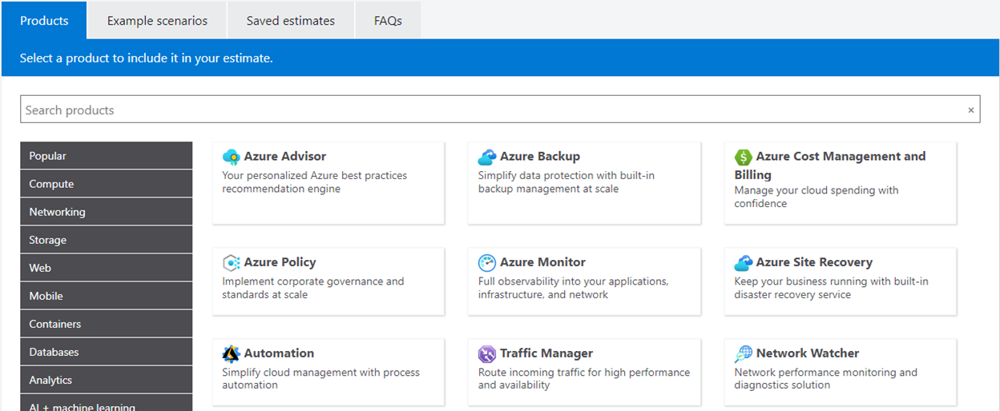
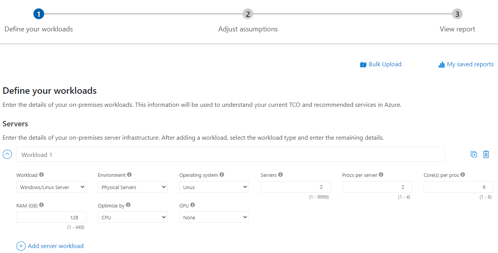
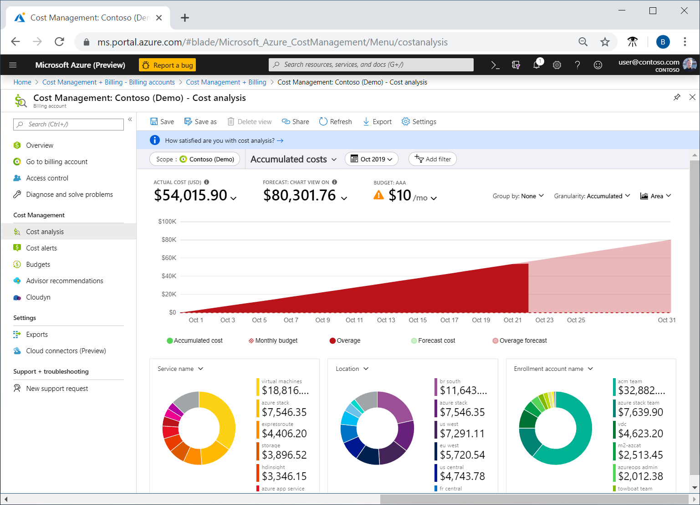
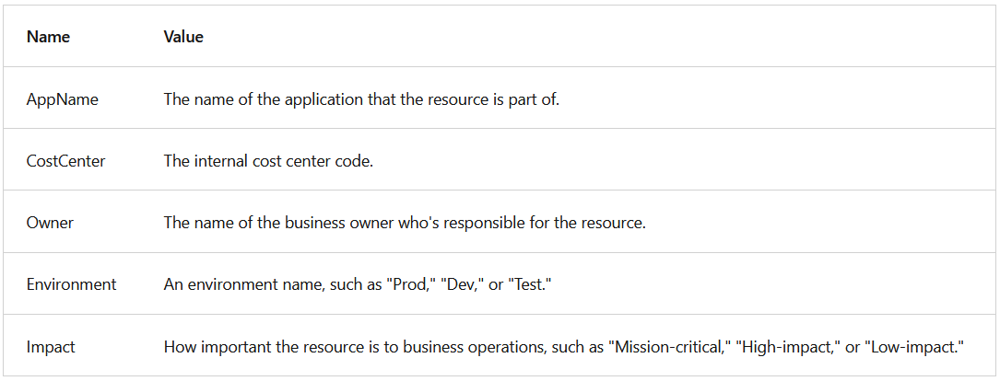

## Describe Cost Management in Azure

### Describe factors that can affect costs in Azure

- **Resource type**
  - A number of factors influence the cost of Azure resources. The type of resources, the settings for the resource, and the Azure region will all have an impact on how much a resource costs. 

- **Consumption**
  - Pay-as-you-go has been a consistent theme throughout, and that’s the cloud payment model where you pay for the resources that you use during a billing cycle.
  - When you reserve capacity, you’re committing to using and paying for a certain amount of Azure resources during a given period (typically one or three years). 

- **Maintenance**

- **Geography**
  - With this global deployment comes global pricing differences. The cost of power, labor, taxes, and fees vary depending on the location.

- **Network Traffic**
  - Billing zones are a factor in determining the cost of some Azure services.
  - Bandwidth refers to data moving in and out of Azure datacenters. 
  - Some inbound data transfers (data going into Azure datacenters) are free. For outbound data transfers (data leaving Azure datacenters), data transfer pricing is based on zones.
  - https://azure.microsoft.com/en-us/pricing/details/bandwidth/

- **Subscription type**
  - Some Azure subscription types also include usage allowances, which affect costs.

- **Azure Marketplace**
  - Azure Marketplace lets you purchase Azure-based solutions and services from third-party vendors.
  - https://learn.microsoft.com/en-us/legal/marketplace/certification-policies

---

### Compare the Pricing and Total Cost of Ownership calculators

- The pricing calculator and the total cost of ownership (TCO) calculator are two calculators that help you understand potential Azure expenses.

- **Pricing calculator**
  - The pricing calculator is designed to give you an estimated cost for provisioning resources in Azure.
  - 

- **TCO calculator**
  - The TCO calculator is designed to help you compare the costs for running an on-premises infrastructure compared to an Azure Cloud infrastructure.
  - With the TCO calculator, you enter your configuration, add in assumptions like power and IT labor costs, and are presented with an estimation of the cost difference to run the same environment in your current datacenter or in Azure.
  - 
  
- The Pricing calculator is for information purposes only. The prices are only an estimate, and you won't be charged for any services you select.
- https://azure.microsoft.com/en-us/pricing/calculator/

---

### Describe the Microsoft Cost Management tool

- Cost Management provides the ability to quickly check Azure resource costs, create alerts based on resource spend, and create budgets that can be used to automate management of resources.
- 

- **Cost alerts** provide a single location to quickly check on all of the different alert types that may show up in the Cost Management service. The three types of alerts that may show up are:

  - **Budget alerts**
    - Budget alerts notify you when spending, based on usage or cost, reaches or exceeds the amount defined in the alert condition of the budget.
    - In the Azure portal, budgets are defined by cost. 
    - Budgets are defined by cost or by consumption usage when using the Azure Consumption API. 
    - Budget alerts support both cost-based and usage-based budgets.

  - **Credit alerts**
    - Credit alerts notify you when your Azure credit monetary commitments are consumed. 
    - Monetary commitments are for organizations with Enterprise Agreements (EAs). 
    - Credit alerts are generated automatically at 90% and at 100% of your Azure credit balance. 

  - **Department spending quota alerts**
    - Department spending quota alerts notify you when department spending reaches a fixed threshold of the quota. 
    - Spending quotas are configured in the EA portal. 

- A **budget** is where you set a spending limit for Azure. You can set budgets based on a subscription, resource group, service type, or other criteria. 
  - When you set a budget, you will also set a budget alert. 

---

### Describe the purpose of tags

- Resource tags are another way to organize resources. Tags provide extra information, or metadata, about your resources. This metadata is useful for:

  - **Resource management** – Tags enable you to locate and act on resources that are associated with specific workloads, environments, business units, and owners.
  - **Cost management and optimization** – Tags enable you to group resources so that you can report on costs, allocate internal cost centers, track budgets, and forecast estimated cost.
  - **Operations management** – Tags enable you to group resources according to how critical their availability is to your business. This grouping helps you formulate service-level agreements (SLAs).
  - **Security** – Tags enable you to classify data by its security level, such as public or confidential.
  - **Governance and regulatory compliance** – Tags enable you to identify resources that align with governance or regulatory compliance requirements, such as ISO 27001. Tags can also be part of your standards enforcement efforts.
  - **Workload optimization and automation** – Tags can help you visualize all of the resources that participate in complex deployments. You might tag a resource with its associated workload or application name and use Azure DevOps to perform automated tasks on those resources.

- You can add, modify, or delete resource tags through:
  - Windows PowerShell
  - The Azure CLI
  - Azure Resource Manager templates
  - The REST API
  - The Azure portal

- You can use **Azure Policy** to enforce tagging rules and conventions.
  - For example, you can require that certain tags be added to new resources as they're provisioned.
- 

## Describe features and tools in Azure for governance and compliance
→ Not started yet ❌

## Describe features and tools for managing and deploying Azure resources 
→ Not started yet ❌

## Describe monitoring tools in Azure
→ Not started yet ❌
