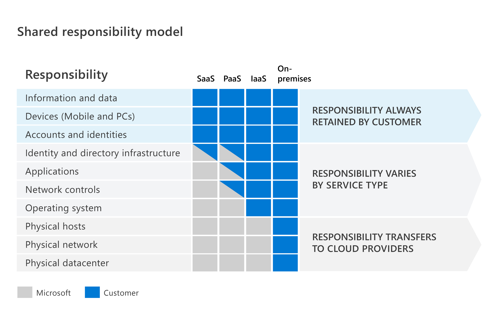
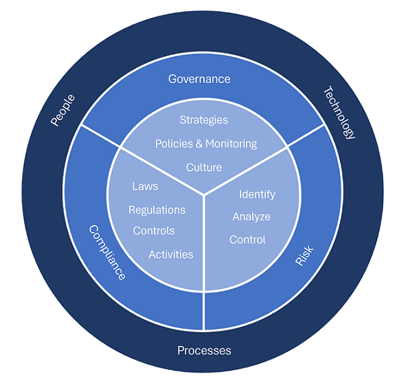

# Shared Responsibility Model
- Identifies which security tasks are handled by the cloud provider, and which security tasks are handled by you, the customer.
- **On-premises datacenters**: In an on-premises datacenter, you have responsibility for everything from physical security to encrypting sensitive data.
- **Infrastructure as a Service (IaaS)**: Of all cloud services, IaaS requires the most management by the cloud customer. The cloud customer isn't responsible for the physical components, such as computers, the network, or the physical security of the datacenter.
- **Platform as a Service (PaaS)**: The cloud provider manages the hardware and operating systems, and the customer is responsible for applications and data.
- **Software as a Service (SaaS)**: SaaS requires the least amount of management by the cloud customer. The cloud provider is responsible for managing everything except data, devices, accounts, and identities.
- **In summary**, responsibilities always retained by the customer organization include:
  - Information and data  
  - Devices (mobile and PCs)  
  - Accounts and identities
  - 

# Defense in Depth
- Uses a layered approach to security, rather than relying on a single perimeter.
- Layers of security might include:
  - **Physical security** such as limiting access to a datacenter to only authorized personnel.
  - **Identity and access security controls**, such as multifactor authentication or condition-based access, to control access to infrastructure and change control.
  - **Perimeter security** of your corporate network includes distributed denial of service (DDoS) protection.
  - **Network security**, such as network segmentation and network access controls.
  - **Compute layer security**, securing access to virtual machines by closing certain ports.
  - **Application layer security** to ensure applications are secure and free of vulnerabilities.
  - **Data layer security**, including access controls and encryption.

## Confidentiality, Integrity, Availability (CIA)
- **Confidentiality**: Keep sensitive data (e.g., customer info, passwords) confidential.
- **Integrity**: Ensure data hasn't been altered or tampered with.
- **Availability**: Ensure data is accessible when needed.

# Zero Trust Model
- Assumes everything is on an open and untrusted network.
- Operates on the principle of “trust no one, verify everything.”

## In practice
- No longer assume passwords are sufficient.
- Use multi-factor authentication for additional checks.

## Zero Trust Guiding Principles
- **Verify explicitly**: Authenticate and authorize based on identity, location, device, data, etc.
- **Least privileged access**: Limit access with JIT/JEA, risk-based policies, data protection.
- **Assume breach**: Segment access, use encryption, analytics, and monitoring.

## Six Foundational Pillars
- **Identities**: Must be verified with strong authentication and least privilege access.
- **Devices**: Monitor device health and compliance.
- **Applications**: Discover and manage all applications including Shadow IT.
- **Data**: Classify, label, and encrypt. Protect data across its lifecycle.
- **Infrastructure**: Assess versions/configs, use JIT access, and detect anomalies.
- **Networks**: Use microsegmentation, real-time threat protection, encryption, and analytics.

# Encryption and Hashing

## Encryption
- Makes data unreadable to unauthorized users.
- **Symmetric encryption**: Same key for encryption and decryption.
- **Asymmetric encryption**: Uses a public/private key pair.

### Encryption Types
- **Data at rest**: Stored data on servers, databases; needs encryption.
- **Data in transit**: Data moving across networks; needs encryption.
- **Data in use**: Data in RAM or CPU cache; may be encrypted.

## Hashing
- Converts text to a unique fixed-length value (hash) using algorithms.

# Governance, Risk, and Compliance (GRC)

## Framework
- Implement policies, processes, and technologies.

## Governance
- System of rules, practices, and processes for directing the organization.

## Risk
- Identifying, assessing, and responding to threats to objectives.

## Compliance
- Meeting legal/regulatory standards based on location.

### Compliance Considerations
- **Data residency**: Where data is stored and processed.
- **Data sovereignty**: Data subject to local jurisdiction laws.
- **Data privacy**: Transparency in collecting, processing, and sharing data.
- 

# Identity Concept
An identity is the set of things that define or characterize someone or something

## Authentication
Authentication is the process of proving that a person is who they say they are.  Authentication is sometimes shortened to AuthN.

## Authorization
Determines the level of access or the permissions an authenticated person has to your data and resources. Authorization is sometimes shortened to AuthZ.

## Identity as the primary security perimeter

## Four pillars of an identity infrastructure
- **Administration**: Administration is about the creation and management/governance of identities for users, devices, and services.
- **Authentication**: The authentication pillar tells the story of how much an IT system needs to know about an identity to have sufficient proof that they really are who they say they are.
- **Authorization**: The authorization pillar is about processing the incoming identity data to determine the level of access an authenticated person or service has within the application or service that it wants to access.
- **Auditing**: The auditing pillar is about tracking who does what, when, where, and how.

## Identity provider
- Modern authentication is an umbrella term for authentication and authorization methods between a client, such as your laptop or phone, and a server, like a website or application.
- An identity provider creates, maintains, and manages identity information while offering authentication, authorization, and auditing services.
- With a central identity provider, organizations can establish authentication and authorization policies, monitor user behavior, identify suspicious activities, and reduce malicious attacks.
- When the identity (which can be a user or an application) has been verified, the identity provider issues a security token that the client sends to the server.
- The server validates the security token through its trust relationship with the identity provider.
- Microsoft Entra ID is an example of a cloud-based identity provider.

## Single sign-on
- The user logs in once and that credential is used to access multiple applications or resources.
- When you set up SSO between multiple identity providers, it's called federation.

## Active Directory (AD)
- The best-known service of this kind is Active Directory Domain Services (AD DS). It stores information about members of the domain, including devices and users, verifies their credentials, and defines their access rights.
- A server running AD DS is a domain controller (DC).
- AD DS doesn't, however, natively support mobile devices, SaaS applications, or line of business apps that require modern authentication methods.
- Microsoft Entra ID and part of the Microsoft Entra family of multicloud identity and access solutions is an example of that evolution and provides organizations with an Identity as a Service (IDaaS) solution for all their apps across cloud and on-premises.

## Federation
- Enables the access of services across organizational or domain boundaries by establishing trust relationships between the respective domain’s identity provider.
- With federation, trust isn't always bidirectional.
- 

## Hybrid identity
Microsoft supports the following three methods for hybrid identities to authenticate:

### Azure AD password hash synchronization
- The most straightforward approach for synchronizing these two versions of the active directory is Azure AD password hash synchronization. With this method, the user can use the same username and password from the on-premises Active Directory and the cloud-based applications.
- 

### Azure AD pass-through authentication
- An alternative approach is Azure AD pass-through authentication. Similar to password hash synchronization, this approach enables you to authenticate through either on-premises or cloud-based applications. However, a significant difference is that the password is compared in real-time. Therefore, password validation always occurs on-premises rather than in the cloud.
- 

### Federated access
- In a federated authentication setup, Azure AD delegates the authentication process to a separate trusted authentication system, such as on-premises Active Directory Federation Services (AD FS). This external system is responsible for validating the user's password and ensuring that all user authentication takes place on-premises, which can be advantageous for certain security and compliance requirements.
- One notable benefit of using federated authentication with AD FS is the ability to set up password hash synchronization as a contingency plan. Password hash synchronization can act as a backup authentication mechanism if the AD FS infrastructure encounters issues or becomes unavailable.
- Federated authentication is recommended for organizations seeking advanced authentication features not currently available in Azure AD. This method is particularly suitable for scenarios that involve sign-on using smart cards or certificates, on-premises multi-factor authentication (MFA) server, and third-party authentication solutions.
- 

## Identity providers

### Azure AD B2B (Business-to-Business)
- Azure enables secure collaboration between businesses by granting them 'guest' status. This method of access allows you to customize and control the guest's access to your system. For instance, you can restrict movement and limit access to specific applications or data.

### Azure AD B2C (Business-to-Customer)
- Azure Active Directory B2C provides business-to-customer identity as a service. It involves creating, validating, and maintaining customer identities for authentication. Azure AD’s B2C option is ideal for businesses that want to onboard clients for an application because it offers white-label authentication. White-label authentication means that businesses can easily create their own authentication process with templates that can be customized with their own branding and interface.

- Which of the following is a protocol used to configure business-to-customer (B2C)?
  - SAML

Azure AD can be configured to determine the security posture for Azure AD Domain Services (AAD DS) through the use of GPO

