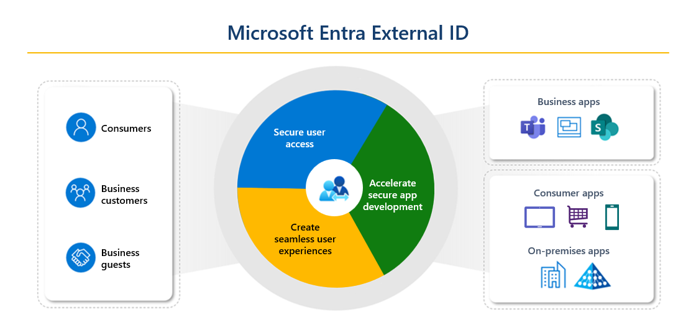
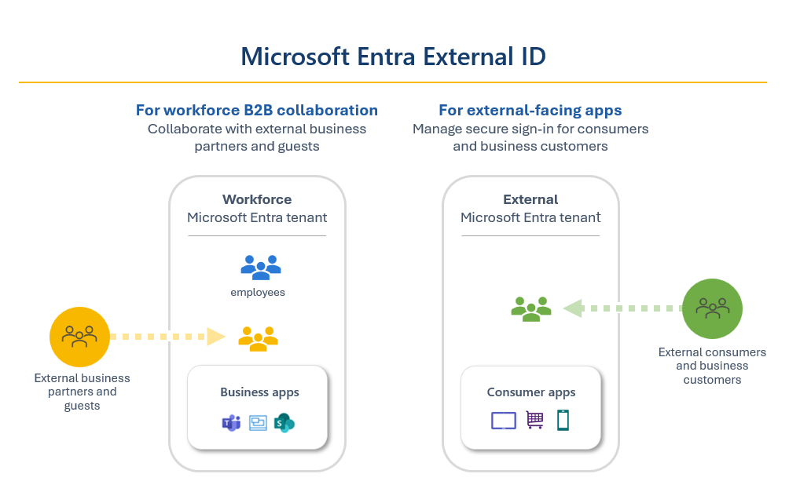
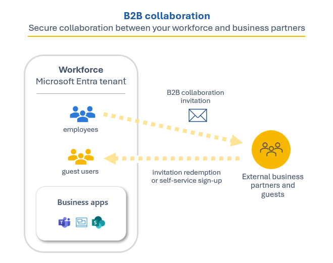
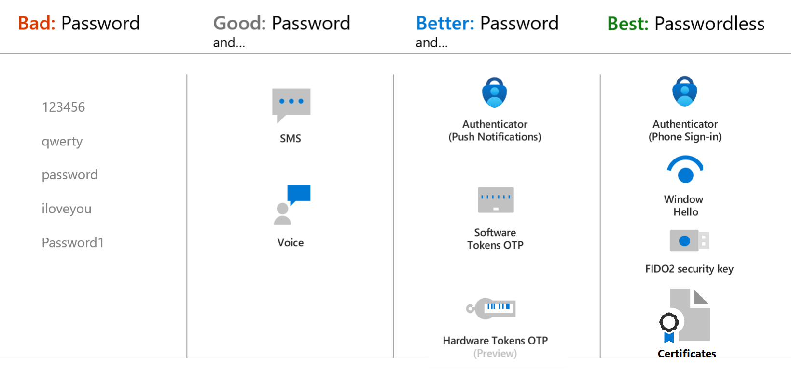
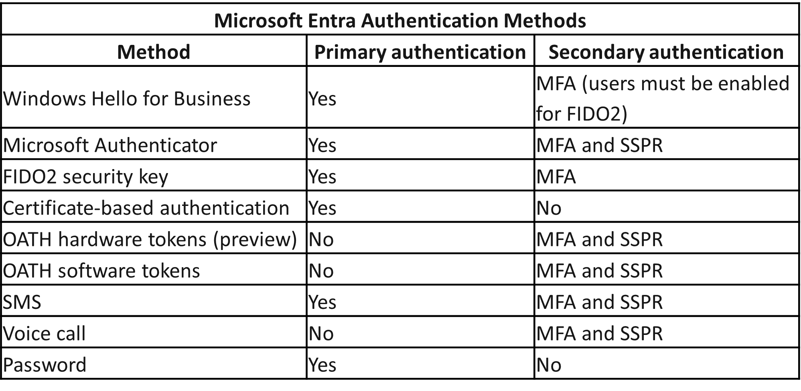
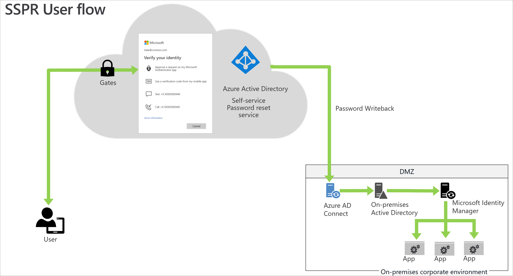

# Basic Concept

- formerly Azure Active Directory, is Microsoft’s cloud-based identity and access management service.
- Organizations use Microsoft Entra ID to:
  - Internal resources, such as apps on your corporate network and intranet, and cloud apps developed by your own organization.
  - External services, such as Microsoft Office 365, the Azure portal, and any SaaS applications used by your organization.
- Microsoft Entra ID also allows organizations to securely enable the use of personal devices, such as mobiles and tablets, and enable collaboration with business partners and customers.

- **Identity Secure Score**: which is a percentage that functions as an indicator for how aligned you are with Microsoft's best practice recommendations for security.
  - Each improvement action in identity secure score is tailored to your specific configuration.
  - Helps you to objectively measure your identity security posture, plan identity security improvements, and review the success of your improvements.
  - 

- **Basic terminology:**
  - **Tenant**: A Microsoft Entra tenant is an instance of Microsoft Entra ID in which information about a single organization resides including organizational objects such as users, groups, devices, and application registrations.
    - A tenant also contains access and compliance policies for resources, such as applications registered in the directory.
    - Each Microsoft Entra tenant has a unique ID (tenant ID) and a domain name.
  - **Directory**: The directory is a logical container within a Microsoft Entra tenant that holds and organizes the various resources and objects related to identity and access management including users, groups, applications, devices, and other directory objects.
    - The directory is like a database or catalog of identities and resources associated with an organization's tenant.
    - A Microsoft Entra tenant consists of only one directory.
  - **Multi-tenant**: Is an organization that has more than one instance of Microsoft Entra ID.
    - Organizations with multiple subsidiaries or business units that operate independently.
    - Organizations that merge or acquire companies.
    - Multiple geographical boundaries with various residency regulations.

- **Who uses Microsoft Entra ID?**
  - Used by IT admins to control access to corporate apps and resources, based on business requirements.
  - Microsoft Entra ID can also be set up to require multi-factor authentication when accessing important organizational resources.
  - Developers use Microsoft Entra ID as a standards-based approach for adding single sign-on (SSO) to their apps.
  - Microsoft Entra ID also provides application programming interfaces (APIs) that allow developers to build personalized app experiences using existing organizational data.

> Subscribers to Azure services, Microsoft 365, or Dynamics 365 automatically have access to Microsoft Entra ID.

# Function and Identity Types of Microsoft Entra ID

## User

User identities represent individuals, including employees and external users (such as customers, consultants, vendors, and partners).

- User identities are characterized by how they authenticate and the user type property.
- Internal authentication means the user has an account on the host organization’s Microsoft Entra ID and uses that account to authenticate to Microsoft Entra ID.
- External authentication means the user authenticates using an external Microsoft Entra account that belongs to another organization, a social network identity, or another external identity provider.
- The user type property describes the user’s relationship to the organization or more specifically, the host organization’s tenancy.
- 

  - **Internal members:** These users are typically considered employees of your organization.
  - **Internal guest:** This scenario exists when organizations who collaborate with distributors, suppliers, and vendors set up internal Microsoft Entra accounts for these users but designate them as guests by setting the user object UserType to Guest.
    - With B2B collaboration users can use their own credentials, allowing their external identity provider to manage authentication and their account lifecycle.
  - **External guest:** External users or guests, including consultants, vendors, and partners, typically fall into this category.
  - **External member:** This scenario is common in organizations consisting of multiple tenants.

- External guests and external members are business-to-business (B2B) collaboration users that fall under the category of external identities in Microsoft Entra ID.

---

## Workload Identities

- A workload identity is an identity you assign to a software workload.
- A software workload may deal with multiple credentials to access different resources and those credentials need to be stored securely.
- Enterprises risk their applications or services being exploited or breached because of difficulties in securing workload identities.
- Microsoft Entra Workload ID helps resolve these issues when securing workload identities.

### In Microsoft Entra, workload identities are:

#### Applications and Service Principals

- A service principal is essentially, an identity for an application.
- For an application to delegate its identity and access functions to Microsoft Entra ID, the application must first be registered with Microsoft Entra ID to enable its integration.
- Once an application is registered, a service principal is created in each Microsoft Entra tenant where the application is used.
- Developers must manage and protect the credentials. If not done correctly, this can introduce security vulnerabilities.
- Managed identities help off-load that responsibility from the developer.

#### Managed Identities

- Managed identities are a type of service principal that are automatically managed in Microsoft Entra ID and eliminate the need for developers to manage credentials.
- 

There are two types of managed identities:

##### System-assigned

- Some Azure resources, such as virtual machines, allow you to enable a managed identity directly on the resource.
- Azure automatically deletes the identity for you.
- An example where you may find a system-assigned identity is when a workload is contained within a single Azure resource, such as an application that runs on a single virtual machine.

##### User-assigned

- You may also create a managed identity as a standalone Azure resource.
- Once you create a user-assigned managed identity, you can assign it to one or more instances of an Azure service.
- The identity is managed separately from the resources that use it.
- This is useful in a scenario where you may have multiple VMs that all have the same set of permissions but may get recycled frequently.
- Deleting any of the VMs doesn’t impact the user-assigned managed identity.

## Device

Device identities can be set up in different ways in Microsoft Entra ID:

- **Microsoft Entra registered devices**  
  The goal of Microsoft Entra registered devices is to provide users with support for bring your own device (BYOD) or mobile device scenarios.

- **Microsoft Entra joined**  
  A Microsoft Entra joined device is a device joined to Microsoft Entra ID through an organizational account, which is then used to sign in to the device.

- **Microsoft Entra hybrid joined devices**  
  These devices are joined to your on-premises Active Directory and Microsoft Entra ID, requiring an organizational account to sign in to the device.

### Notes

- IT admins can use tools like **Microsoft Intune**, a cloud-based service that focuses on mobile device management (MDM) and mobile application management (MAM), to control how an organization’s devices are used.
- 
- [Learn more about Intune](https://learn.microsoft.com/en-us/mem/intune/fundamentals/what-is-intune)

---

## Groups

- In Microsoft Entra ID, if you have several identities with the same access needs, you can create a **group**.

### Group Types

- **Security**  
  A security group is the most common type of group and it's used to manage user and device access to shared resources.  
  _Creating security groups requires a Microsoft Entra administrator role._

- **Microsoft 365**  
  Also known as a distribution group, used for grouping users according to collaboration needs.  
  - Members of a Microsoft 365 group can only include users, including users outside of your organization.  
  - Because these groups are intended for collaboration, the default is to allow users to create them — no admin role needed.

- **Dynamic Membership**  
  Uses rules to automatically add and remove identities.

---

## Hybrid Identity

Hybrid identity is accomplished through provisioning and synchronization.

### Key Concepts

- **Inter-directory provisioning**  
  Provisioning an identity between two different directory services systems.  
  _The most common scenario: a user already in Active Directory is provisioned into Microsoft Entra ID._

- **Synchronization**  
  Responsible for ensuring identity information for your on-premises users and groups matches the cloud.

### Microsoft Entra Cloud Sync

- Designed to meet and accomplish your hybrid identity goals for the provisioning and synchronization of users, groups, and contacts to Microsoft Entra ID.
- Uses the **Microsoft Entra cloud provisioning agent**, a lightweight service that bridges Entra ID and Active Directory.
- Employs the **System for Cross-domain Identity Management (SCIM)** specification to provision and deprovision users and groups.
- SCIM is a standard for automating the exchange of user/group identity information between domains like Microsoft Entra ID, and is becoming the de facto standard for provisioning.

## External Identities

- **Microsoft Entra External ID** combines powerful solutions for working with people outside of your organization.
- 

### Scenarios Addressed:

- Collaborate with business guests
- Secure your apps for consumers and business customers

### Tenant Configuration Options:

- **Workforce tenant configuration**:  
  For employees, internal business apps, and other organizational resources.  
  You can invite external business partners and guests to your workforce tenant.

- **External tenant configuration**:  
  Used exclusively for External ID scenarios, such as publishing apps to consumers or business customers.

### Collaborate with Business Guests

- External ID B2B collaboration allows your workforce to collaborate with external business partners.
- You can share your company's applications and services with guests via your workforce tenant while maintaining control over your corporate data.
- You can invite anyone to sign in using their own credentials to access shared apps and resources.
- Use B2B collaboration for Office 365 apps, SaaS apps, and line-of-business apps.
- Business guests have no credentials in your system; they authenticate via their home identity provider.
- Your organization checks the user’s eligibility for guest collaboration.
- 

### Secure Your Apps for Consumers and Business Customers

- Microsoft Entra External ID includes Microsoft's **Customer Identity and Access Management (CIAM)** solution.
- Features include:
  - Self-service registration
  - Personalized sign-in experiences
  - SSO with social and enterprise identities
  - Customer account management
  - 

---

## Authentication Capabilities of Microsoft Entra ID

### Authentication Methods

- **Passwords**  
  Most common method, but insecure as a single-factor method.
  

- **Phone-based Authentication**
  - **SMS-based**: Used as primary or secondary authentication in SSPR or MFA.
  - **Voice call**: Used as a secondary method for verification in SSPR or MFA.

- **OATH (Open Authentication)**
  - **Software OATH tokens**: Apps that generate OTP using a seed.
  - **Hardware OATH tokens**: Key fob-like devices with rotating codes.
  - _Note: Only supported as secondary forms of authentication in Entra ID._

- **Passwordless Authentication**
  - **Windows Hello for Business**
    - Replaces passwords with strong two-factor authentication.
    - Combines device-based key/cert + something you know (PIN) or are (biometrics).
  - **FIDO2**
    - Open standard that eliminates usernames/passwords via external or platform keys.
    - Supports USB, Bluetooth, NFC devices.
    - Supported by Microsoft Entra ID for both web and Windows sign-ins.
  - **Microsoft Authenticator App**
    - Can be used as primary authentication or secondary verification.
    - Can also act as an OATH software token.
  - **Certificate-based Authentication (CBA)**
    - Uses X.509 certificates for primary authentication.
    - Supported for apps and browser sign-ins.
    - X.509 certs are part of public key infrastructure (PKI).

- **Primary and Secondary Authentication**
  

---

### Multifactor Authentication (MFA)

- MFA prompts users for an additional form of ID at sign-in.
- MFA factors:
  - **Something you know** – password/PIN
  - **Something you have** – device or hardware key
  - **Something you are** – biometric info

#### Security Defaults and MFA

- Preconfigured identity security settings from Microsoft.
- Enforced at no extra cost.
- Includes:
  - Requiring MFA registration for all users
  - Enforcing MFA for admins
  - Requiring MFA for all users as needed
- Great for basic security setups or free-tier usage.
- Not ideal for orgs with P1/P2 licenses or complex needs.

---

### Self-Service Password Reset (SSPR)

- Enables users to reset/change their passwords without admin help.

#### Benefits:

- Reduces IT support costs
- Increases user productivity
- Admins can push changes easily
- Includes audit logs (API accessible for SIEM integration)

#### Requirements for SSPR:

- Assigned Microsoft Entra ID license
- Enabled by admin
- Registered authentication methods (recommended: 2+)

#### Authentication Methods for SSPR:

- Mobile app notification
- Mobile app code
- Email
- Mobile phone
- Office phone
- Security questions  
  _Note:_
  - Not used during sign-in events
  - Admins **cannot** use security questions for verification

#### Notifications:

- Email alerts for SSPR events
- All global admins are notified when SSPR is used on admin accounts
- 

---

### Password Protection and Management

- **Microsoft Entra Password Protection** blocks weak and known-compromised passwords.

#### Global Banned Password List:

- Maintained by Entra ID Protection team
- Uses telemetry to identify risky passwords
- Includes variants like "P@ssw0rd" via pattern substitution
- Applied to all users; cannot be disabled

#### Custom Banned Password Lists:

- Admins can define org-specific password bans
- Available with P1 or P2 licenses

#### Protection from Password Spray Attacks:

- Efficient blocking of weak, frequently used passwords

#### Hybrid Security:

- Password protection can be extended to on-prem Active Directory
- Ensures consistent enforcement across environments

