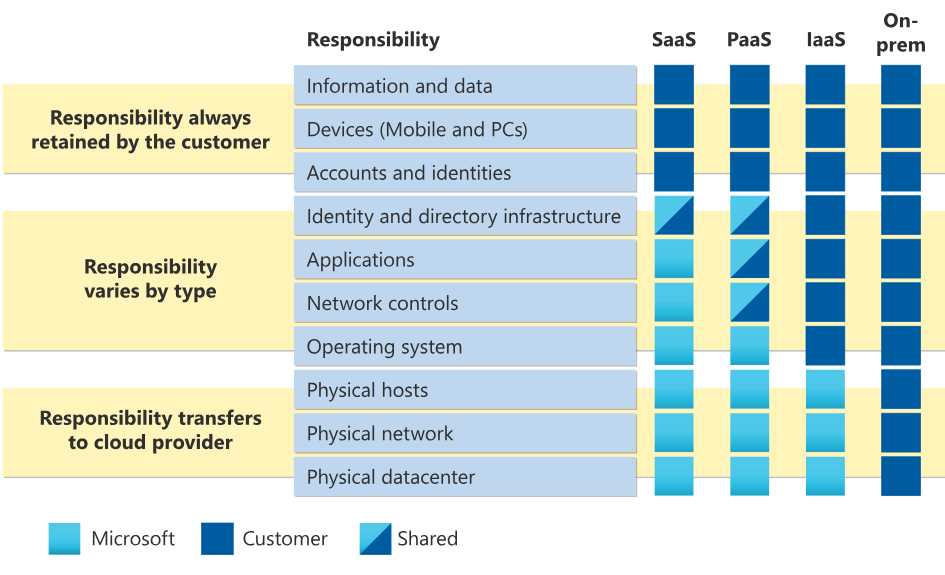
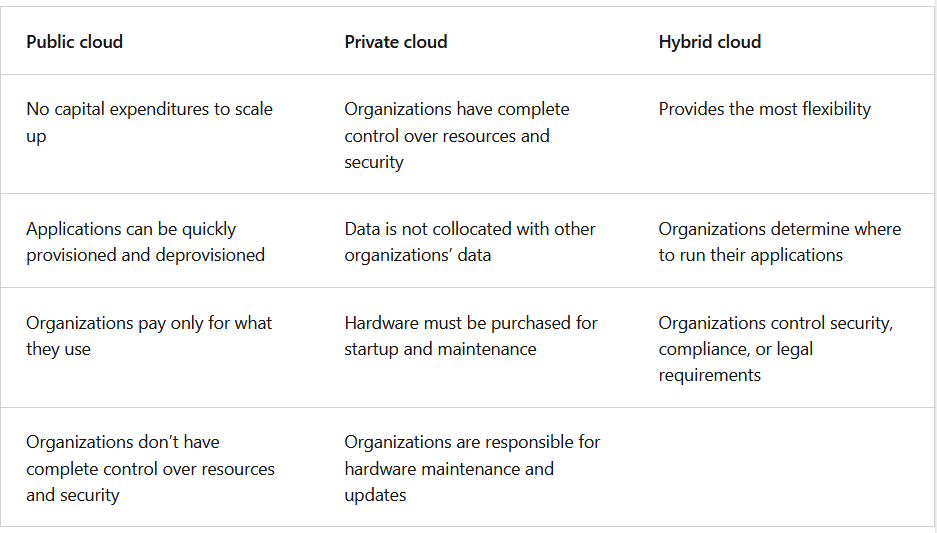

# مفاهیم پایه‌ای رایانش ابری (Cloud Computing)

اگر تازه با مفاهیم رایانش ابری آشنا می‌شوید یا قصد دارید برای آزمون AZ-900 آماده شوید، آشنایی با اصول پایه‌ای Cloud Computing می‌تواند مسیر یادگیری را برایتان هموارتر کند. در این نوشته، سعی کرده‌ام مهم‌ترین مفاهیم مرتبط با فضای ابری را به‌صورت خلاصه، کاربردی و قابل فهم توضیح دهم.

---

## ☁️ رایانش ابری و یا Cloud Computing چیست؟

رایانش ابری به معنای ارائه خدمات کامپیوتری (مانند ماشین‌های مجازی، پایگاه‌داده، فضای ذخیره‌سازی و...) از طریق اینترنت است؛ بدون نیاز به خرید سخت‌افزار یا مدیریت فیزیکی آن‌ها.

این خدمات فراتر از زیرساخت هستند و حوزه‌هایی مانند اینترنت اشیاء (IoT)، یادگیری ماشین (ML) و هوش مصنوعی (AI) را نیز دربر می‌گیرند. این قابلیت‌ها از طریق بسترهای ابری مختلف در دسترس هستند.

---

## 🔐 مدل مسئولیت مشترک (Shared Responsibility Model)

در استفاده از خدمات ابری، مسئولیت‌ها بین ارائه‌دهنده سرویس و استفاده‌کننده تقسیم می‌شود. این مدل باعث می‌شود مصرف‌کننده بداند که چه بخش‌هایی از امنیت و مدیریت سیستم، بر عهده‌ی خودش است.

### مسئولیت‌های کاربر:
- مدیریت داده‌ها و اطلاعات  
- کنترل دستگاه‌های متصل  
- مدیریت هویت‌ها و حساب‌های کاربری  

### مسئولیت‌های ارائه‌دهنده سرویس ابری:
- زیرساخت فیزیکی  
- شبکه و دیتاسنتر  
- نگهداری از سخت‌افزار  

---

## 🧱 مدل‌های رایانش ابری

چهار مدل اصلی برای پیاده‌سازی رایانش ابری وجود دارد:

### ✅ Private Cloud
تمامی منابع برای یک سازمان خاص رزرو شده‌اند. زیرساخت می‌تواند در محل سازمان باشد یا توسط شرکت دیگری در محیطی اختصاصی مدیریت شود. مناسب برای نهادهایی با الزامات امنیتی یا قانونی خاص.

### ✅ Public Cloud
منابع توسط ارائه‌دهنده‌ی خدمات ابری مدیریت می‌شوند و برای عموم کاربران در دسترس هستند. مناسب برای تیم‌های کوچک یا کسب‌وکارهایی با محدودیت منابع.

### ✅ Hybrid Cloud
ترکیبی از دو مدل قبلی. داده‌های حساس در فضای خصوصی باقی می‌مانند، در حالی که عملیات دیگر از طریق فضای عمومی انجام می‌شود.

### ✅ Multi-cloud
سازمان از چند ارائه‌دهنده‌ی مختلف به‌صورت هم‌زمان استفاده می‌کند. هدف: افزایش پایداری، کاهش وابستگی به یک سرویس خاص و بهینه‌سازی هزینه.

---

## فناوری Azure Arc چیست؟

Azure Arc ابزاری برای مدیریت منابعی است که خارج از پلتفرم Azure قرار دارند. مثل سرورها، خوشه‌های Kubernetes یا منابع دیگر روی بسترهای غیرمایکروسافتی. کاربردی برای محیط‌های hybrid و multi-cloud.

---

##  فناوری Azure VMware Solution چیست؟

برای سازمان‌هایی که از VMware استفاده می‌کنند و قصد مهاجرت به Azure را دارند، بدون تغییر ساختار فعلی، می‌توان ماشین‌های مجازی را با ابزارهای قبلی روی Azure اجرا کرد. این راهکار نیاز به بازطراحی زیرساخت را کاهش می‌دهد.

---

##  مدل مصرف‌محور (Consumption-based Model)

در مدل‌های ابری، پرداخت هزینه بر اساس مصرف انجام می‌شود. به‌جای سرمایه‌گذاری اولیه (CapEx)، هزینه‌ها در قالب عملیات جاری (OpEx) مدیریت می‌شوند.

---

## ⚙️ مزایای رایانش ابری

###  High Availability & Scalability
امکان مقیاس‌پذیری افقی و عمودی، در کنار مقاومت در برابر خرابی‌ها یا افزایش تقاضا.

###  Reliability & Predictability
پیش‌بینی‌پذیری هزینه‌ها و اطمینان از عملکرد سیستم. ابزارهایی مثل ماشین‌حساب هزینه (TCO) کمک‌کننده‌اند.

###  Security & Governance
امکان پیاده‌سازی سیاست‌های امنیتی با ابزارهای مدیریتی Azure برای سازمان‌هایی با الزامات خاص.

###  Manageability
مدیریت منابع از طریق پورتال، CLI، PowerShell یا API امکان‌پذیر است. قابلیت نظارت و بهینه‌سازی منابع وجود دارد.

---

## 🧩 مدل‌های سرویس ابری

###  IaaS – Infrastructure as a Service
زیرساخت کامل در اختیار کاربر است. مناسب برای:
- مهاجرت از دیتاسنتر سنتی  
- توسعه و تست

###  PaaS – Platform as a Service
پلتفرم آماده توسعه نرم‌افزار بدون نیاز به مدیریت زیرساخت. مناسب برای:
- توسعه سریع اپلیکیشن‌ها  
- تحلیل‌های داده و BI  

###  SaaS – Software as a Service
نرم‌افزارها از طریق اینترنت ارائه می‌شوند، بدون نیاز به نصب یا نگهداری. مانند:
- سرویس‌های ایمیل  
- اپلیکیشن‌های مالی و اداری  

---

## 📌 جمع‌بندی

درک مفاهیم پایه‌ای رایانش ابری، به‌ویژه در مسیر یادگیری آزمون AZ-900، یکی از گام‌های کلیدی برای ورود به دنیای فناوری ابری است.  
در ادامه‌ی این مجموعه، قصد دارم به صورت عملی‌تر، نحوه استفاده از سرویس‌هایی مانند Azure VMware Solution را بررسی کنم و ببینیم چگونه می‌توان از مزایای فضای ابری در کنار زیرساخت‌های فعلی بهره‌برداری کرد.
