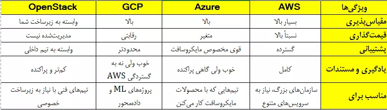

# مقایسه Azure، AWS، GCP و OpenStack؛ کدام سرویس ابری برای ما مناسب‌تر است؟

در دنیای امروز، انتخاب یک پلتفرم ابری مناسب تبدیل به یکی از تصمیم‌های مهم برای تیم‌های فنی، استارتاپ‌ها و حتی سازمان‌های بزرگ شده. گزینه‌های زیادی روی میز هست، اما چهار مورد از رایج‌ترین‌هاش این‌ها هستن: Amazon Web Services (AWS)، Microsoft Azure، Google Cloud Platform (GCP) و OpenStack.

توی این مطلب، یه بررسی کوتاه روی هرکدوم داریم و بعدش مقایسه‌شون می‌کنیم از نظر کارایی، قیمت، پشتیبانی، انعطاف‌پذیری و... تا بتونیم انتخاب راحت‌تری داشته باشیم.

## تجربه، مقیاس و تنوع بالا - AWS

سرویس AWS که توسط آمازون ارائه می‌شه، یکی از قدیمی‌ترین و البته بزرگ‌ترین ارائه‌دهنده‌های خدمات ابریه. تقریباً هر سرویس ابری که تصورش رو بکنید، تو AWS وجود داره: Compute، Storage، Networking، ML/AI، پایگاه داده، امنیت و کلی ابزار Dev-ops.

نقاط قوت: مقیاس‌پذیری بالا، اکوسیستم گسترده، پایداری زیاد  
نقاط ضعف: قیمت بالا، پیچیدگی در پیکربندی برای تازه‌کارها

## همگام با اکوسیستم مایکروسافت - Microsoft Azure

اگه توی شرکت یا سازمانت از محصولات مایکروسافت استفاده می‌کنی (مثلاً Windows Server، Active Directory، یا SQL Server)، Azure می‌تونه انتخاب خیلی خوبی باشه. چون یکپارچگی خیلی خوبی با این ابزارها داره.

نقاط قوت: ادغام با سرویس‌های مایکروسافت، پشتیبانی قوی، مناسب برای کسب‌وکارها  
نقاط ضعف: بعضی خدماتش هنوز به بلوغ AWS نرسیدن، مستندسازی گاهی ناقصه

## قدرت در داده و یادگیری ماشین - Google Cloud Platform (GCP)

گوگل هم وارد این رقابت شده و تمرکزش بیشتر روی دیتا، آنالیتیکس و ماشین لرنینگه. اگه با BigQuery، Kubernetes یا مدل‌های ML سر و کار داری، GCP حسابی می‌تونه کمک‌کننده باشه.

نقاط قوت: قدرت بالا در آنالیز داده و هوش مصنوعی، پرفورمنس بالا  
نقاط ضعف: پوشش کمتر دیتاسنتر نسبت به AWS/Azure، سرویس‌های تجاری محدودتر

## کنترل کامل، هزینه پایین (در ظاهر) - OpenStack

برخلاف سه مورد قبلی که سرویس‌های مدیریت‌شده ارائه می‌دن، OpenStack یه پلتفرم متن‌باز برای ساختن سرویس ابریه که باید خودت نصب و نگهداریش کنی. برای شرکت‌هایی که می‌خوان دیتاشون تو زیرساخت خصوصی بمونه یا به دلایل قانونی نمی‌خوان از سرویس‌های عمومی استفاده کنن، گزینه خوبیه.

نقاط قوت: کنترل کامل روی زیرساخت، رایگان بودن نرم‌افزار  
نقاط ضعف: نیاز به تیم فنی قوی برای نگهداری، پیچیدگی در مقیاس‌پذیری و پشتیبانی

## مقایسه کلی

## جمع‌بندی

انتخاب بین این سرویس‌ها بستگی به نیاز شما، اندازه تیم، مهارت فنی، و بودجه‌تون داره.

- اگه می‌خواید همه‌چیز آماده باشه و سرویس کامل بخواید، AWS رو انتخاب کنید.  
- اگه با ابزارهای مایکروسافت زیاد کار می‌کنید، Azure براتون بهینه‌تره.  
- برای کارهای داده‌محور یا ML، GCP انتخاب خوبی می‌تونه باشه.  
- ولی اگه ترجیح می‌دید همه‌چیز دست خودتون باشه و روی سرورتون پیاده‌سازی کنید، OpenStack می‌تونه گزینه مناسبی باشه.

## قدم بعدی: تمرکز روی Azure

حالا که یه دید کلی نسبت به چهار پلتفرم اصلی رایانش ابری پیدا کردیم و تفاوت‌هاشونو شناختیم، تو پست‌های بعدی تمرکزم رو می‌ذارم روی Microsoft Azure. دلیلش هم اینه که Azure داره توی بازار ایران و حتی بین توسعه‌دهنده‌هایی که با اکوسیستم مایکروسافت کار می‌کنن، محبوب‌تر می‌شه. قراره در ادامه به‌صورت جزئی‌تر وارد امکانات، سرویس‌ها، مزایا، چالش‌ها و حتی سناریوهای واقعی استفاده از Azure بشیم تا اگه خواستید ازش استفاده کنید، با آمادگی بیشتری سراغش برید.
