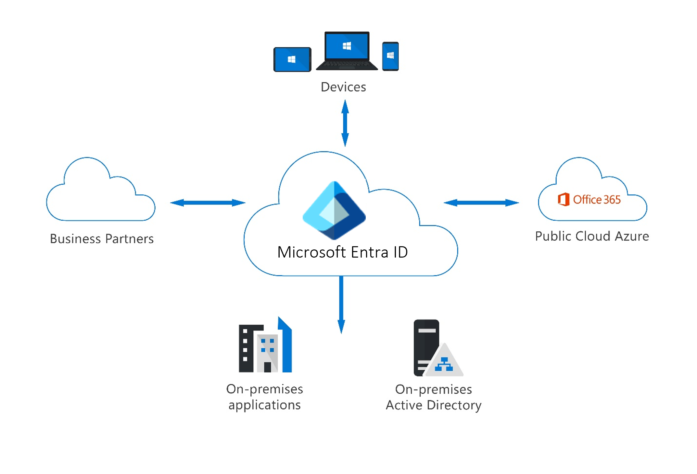
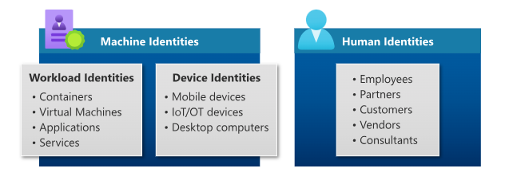
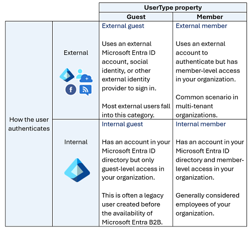
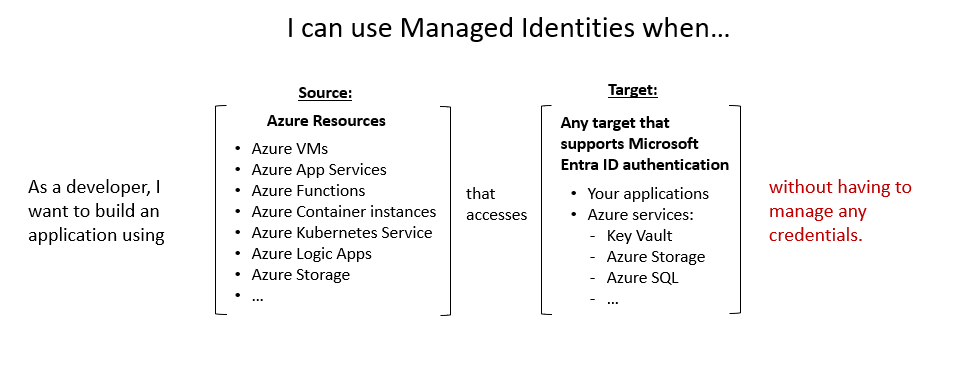
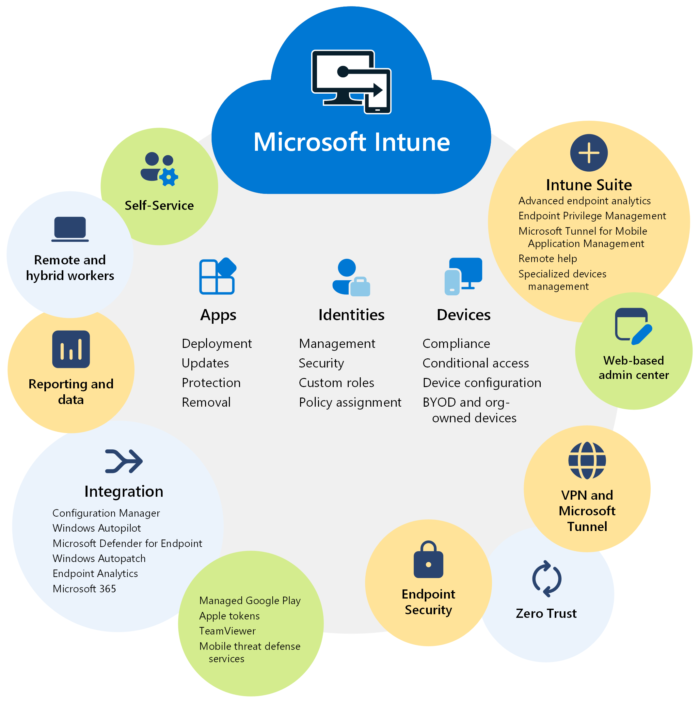

# مدیریت هویت در پاندوراسندباکس با Microsoft Entra ID

در دنیای امروز، مدیریت هویت دیجیتال به یکی از مهم‌ترین چالش‌های سازمان‌ها تبدیل شده است. در پاندوراسندباکس، شرکتی با حدود ۵۰ کارمند که ترکیبی از کارکنان حضوری و دورکار دارد، این چالش به صورت ملموس‌تری احساس می‌شود.

از ابتدا، دغدغه اصلی ما این بود که چگونه می‌توانیم دسترسی کاربران به منابع سازمانی را به گونه‌ای مدیریت کنیم که هم امنیت حفظ شود و هم تجربه کاربری دچار مشکل نشود. استفاده از رمزعبور قوی تنها بخشی از راه‌حل است و نیاز به مکانیزم‌های پیشرفته‌تر، مانند احراز هویت چندمرحله‌ای (MFA) و سیاست‌های دسترسی مبتنی بر شرایط (Conditional Access) به شدت احساس می‌شود.

## چرا Microsoft Entra ID؟

Microsoft Entra ID که در گذشته به عنوان Azure Active Directory شناخته می‌شد، یک سرویس مدیریت هویت و دسترسی است که به ما امکان می‌دهد:

- هویت کاربران، دستگاه‌ها و برنامه‌ها را به صورت متمرکز مدیریت کنیم؛
- دسترسی به منابع را بر اساس نقش و شرایط محیطی کنترل کنیم؛
- امنیت ورود کاربران را با استفاده از MFA و فناوری‌های بدون رمز افزایش دهیم؛
- امکان ادغام با برنامه‌های SaaS و داخلی را فراهم کنیم؛
- و در نهایت، فرآیندهای مربوط به مدیریت دسترسی را ساده و خودکار کنیم.

## هویت کاربران در Microsoft Entra ID: درک انواع و نحوه احراز هویت

یکی از مهم‌ترین بخش‌های مدیریت هویت در Microsoft Entra ID، شناسایی و دسته‌بندی انواع هویت‌های کاربران است. در این سیستم، «هویت کاربران» نماینده افراد مختلفی هستند؛ از کارمندان داخلی گرفته تا مشاوران، مشتریان و شرکای خارجی.

### انواع هویت کاربران

هویت کاربران در Microsoft Entra ID بر اساس دو محور اصلی تعریف می‌شود:

1. نحوه احراز هویت (Authentication Type)  
2. نوع کاربر (User Type)

### نحوه احراز هویت

- **احراز هویت داخلی (Internal Authentication):**  
  کاربران داخلی سازمان دارای حساب کاربری در Microsoft Entra ID همان سازمان هستند. این کاربران با استفاده از همان حساب وارد سیستم می‌شوند و احراز هویت‌شان به صورت داخلی و مستقیم توسط سازمان انجام می‌شود.

- **احراز هویت خارجی (External Authentication):**  
  این حالت مربوط به کاربرانی است که از حساب‌های خارجی برای ورود استفاده می‌کنند. مثلاً کاربری که با حساب Microsoft Entra ID سازمان دیگری، یا هویت شبکه‌های اجتماعی، یا ارائه‌دهندگان هویت خارجی دیگر وارد می‌شود. این کاربران معمولاً در قالب همکاری‌های بین سازمانی (B2B) فعالیت می‌کنند.

### نوع کاربر در Microsoft Entra ID

ویژگی **User Type** نشان‌دهنده رابطه‌ی کاربر با سازمان یا به عبارت دقیق‌تر، با فضای کاری (Tenant) سازمان میزبان است. انواع این ویژگی به شرح زیر هستند:

- **Internal Member (عضو داخلی):**  
  این کاربران معمولاً کارمندان یا اعضای رسمی سازمان محسوب می‌شوند. دسترسی‌ها و مجوزهای آن‌ها بر اساس نقش‌های داخلی تعریف می‌گردد.

- **Internal Guest (مهمان داخلی):**  
  در برخی همکاری‌ها، شرکت‌ها برای شرکا، تامین‌کنندگان یا فروشندگان، حساب Microsoft Entra داخلی ایجاد می‌کنند اما آن‌ها را به‌عنوان «مهمان» ثبت می‌کنند. این کار با تنظیم User Type روی Guest انجام می‌شود.  
  این امکان با همکاری B2B فراهم شده که کاربران مهمان بتوانند با استفاده از حساب و اعتبارنامه خودشان وارد شوند و سازمان میزبان مدیریت احراز هویت و چرخه عمر حساب آن‌ها را به حساب اصلی‌شان واگذار می‌کند.

- **External Guest (مهمان خارجی):**  
  این گروه شامل کاربران خارجی مثل مشاوران، فروشندگان و شرکا می‌شود که از بیرون سازمان و با حساب‌های خارجی خود وارد می‌شوند. این افراد معمولا در قالب همکاری‌های B2B شناخته می‌شوند.

- **External Member (عضو خارجی):**  
  این حالت معمولاً در سازمان‌هایی با چند فضای کاری (multi-tenant) کاربرد دارد. اعضای خارجی که به عنوان بخشی از یک سازمان چندفضایی وارد می‌شوند، در این دسته قرار می‌گیرند.

### خلاصه و نکات مهم

- کاربرانی که به صورت **داخلی** احراز هویت می‌شوند، دارای حساب Microsoft Entra ID در فضای کاری سازمان هستند.  
- کاربران **خارجی** معمولاً از طریق همکاری B2B با استفاده از حساب‌های خارجی یا سازمان‌های دیگر وارد می‌شوند.  
- ویژگی **User Type** به سازمان کمک می‌کند تا سیاست‌های دسترسی، مدیریت هویت و امنیت را بر اساس رابطه کاربر با سازمان به شکل دقیق‌تری اعمال کند.  
- همکاری B2B این امکان را می‌دهد که کاربران مهمان با استفاده از اعتبارنامه‌های اصلی خود وارد شوند و سازمان میزبان مدیریت احراز هویت و چرخه عمر حساب آن‌ها را به ارائه‌دهنده اصلی بسپارد.

## هویت‌های بارکاری (Workload Identities) در Microsoft Entra ID

علاوه بر کاربران انسانی، شرکت پاندوراسندباکس نیاز داشت تا هویت‌هایی را که به نرم‌افزارها و سرویس‌ها اختصاص داده می‌شود، به درستی مدیریت کند. این هویت‌ها که به آنها **هویت‌های بارکاری (Workload Identities)** گفته می‌شود، برای نرم‌افزارها و سرویس‌ها تعیین می‌شوند تا بتوانند به منابع مختلف دسترسی پیدا کنند.

### اهمیت مدیریت هویت‌های بارکاری

نرم‌افزارها معمولاً به چندین اعتبارنامه نیاز دارند تا بتوانند به منابع متنوعی دسترسی داشته باشند. ذخیره و مدیریت این اعتبارنامه‌ها اگر به درستی انجام نشود، می‌تواند منجر به نفوذهای امنیتی شود. به همین دلیل، مدیریت ایمن هویت‌های بارکاری برای محافظت از اپلیکیشن‌ها و سرویس‌ها بسیار حیاتی است.

### انواع هویت‌های بارکاری در Microsoft Entra

در Microsoft Entra، هویت‌های بارکاری شامل دو دسته اصلی هستند:

- **اپلیکیشن‌ها و Service Principals**  
  هر برنامه‌ای که بخواهد به Microsoft Entra ID متصل شود، ابتدا باید در این سرویس ثبت شود. پس از ثبت، یک Service Principal برای آن برنامه در هر فضای کاری (Tenant) که استفاده می‌شود ایجاد می‌گردد.  
  توسعه‌دهندگان مسئول مدیریت و حفاظت از اعتبارنامه‌های مربوط به این برنامه‌ها هستند. مدیریت نامناسب این اعتبارنامه‌ها می‌تواند آسیب‌پذیری‌های امنیتی ایجاد کند.

- **Managed Identities (هویت‌های مدیریت شده)**  
  Managed Identities نوعی از Service Principal هستند که به صورت خودکار توسط Microsoft Entra ID مدیریت می‌شوند و نیاز به مدیریت دستی اعتبارنامه‌ها توسط توسعه‌دهندگان را حذف می‌کنند.  
  Managed Identities به دو دسته تقسیم می‌شوند:

  - **System-assigned Managed Identity:**  
    این نوع هویت مستقیماً به یک منبع Azure مانند یک ماشین مجازی اختصاص داده می‌شود و به صورت خودکار توسط Azure مدیریت و حذف می‌گردد. برای مثال، وقتی یک اپلیکیشن روی یک ماشین مجازی اجرا می‌شود، می‌تواند از این نوع هویت استفاده کند.

  - **User-assigned Managed Identity:**  
    این نوع هویت به صورت یک منبع جداگانه در Azure ایجاد می‌شود و می‌توان آن را به چندین منبع مختلف اختصاص داد. این هویت مستقل از منابع مصرف‌کننده مدیریت می‌شود که مزیت آن در مواردی است که چند ماشین مجازی با یک مجموعه مجوز مشترک دارند ولی چرخه عمر مستقل دارند. حذف یک ماشین مجازی تاثیری روی این هویت ندارد.

---

در پاندوراسندباکس، استفاده از Managed Identities به ما این امکان را داد تا دغدغه‌های امنیتی ناشی از مدیریت اعتبارنامه‌های اپلیکیشن‌ها را به حداقل برسانیم و ضمن حفظ امنیت، عملیات توسعه و پیاده‌سازی را تسهیل کنیم.

---

## مدیریت دستگاه‌ها در Microsoft Entra ID

در پاندوراسندباکس، کاربران از انواع دستگاه‌های مختلفی برای دسترسی به منابع سازمانی استفاده می‌کنند؛ از لپ‌تاپ‌های شخصی گرفته تا موبایل و دستگاه‌های سازمانی. مدیریت هویت دستگاه‌ها یکی از ارکان مهم در حفظ امنیت و مدیریت دسترسی است.

### انواع هویت دستگاه‌ها

Microsoft Entra ID سه نوع اصلی هویت دستگاه را پشتیبانی می‌کند:

- **دستگاه‌های ثبت‌شده در Microsoft Entra (Entra Registered Devices):**  
  این نوع دستگاه‌ها برای پشتیبانی از سناریوهای Bring Your Own Device (BYOD) یا استفاده از دستگاه‌های موبایل طراحی شده‌اند. کاربران می‌توانند دستگاه‌های شخصی خود را ثبت کرده و به منابع سازمانی دسترسی داشته باشند.

- **دستگاه‌های متصل به Microsoft Entra (Entra Joined Devices):**  
  این دستگاه‌ها مستقیماً به Microsoft Entra ID از طریق یک حساب سازمانی متصل شده و برای ورود به دستگاه از همان حساب استفاده می‌شود.

- **دستگاه‌های هیبریدی (Hybrid Joined Devices):**  
  این نوع دستگاه‌ها هم‌زمان به Active Directory داخلی سازمان و Microsoft Entra ID متصل هستند و برای ورود به دستگاه، حساب سازمانی مورد نیاز است.

### مدیریت دستگاه‌ها با Microsoft Intune

برای مدیریت و کنترل دستگاه‌ها، تیم IT پاندوراسندباکس از سرویس Microsoft Intune استفاده می‌کند. این سرویس ابری امکاناتی برای مدیریت دستگاه‌های موبایل (MDM) و مدیریت برنامه‌های موبایل (MAM) فراهم می‌کند تا اطمینان حاصل شود دستگاه‌ها و دسترسی‌ها با سیاست‌های سازمان هماهنگ هستند.  

[اطلاعات بیشتر درباره Microsoft Intune](https://learn.microsoft.com/en-us/mem/intune/fundamentals/what-is-intune)

---

## گروه‌ها در Microsoft Entra ID

در شرایطی که چندین هویت (کاربر یا دستگاه) نیاز به دسترسی مشابه به منابع سازمانی دارند، می‌توان آن‌ها را در قالب **گروه‌ها** مدیریت کرد تا دسترسی‌ها به شکل موثرتری کنترل شود.

### انواع گروه‌ها

- **گروه‌های امنیتی (Security Groups):**  
  این گروه‌ها رایج‌ترین نوع گروه‌ها هستند و برای مدیریت دسترسی کاربران و دستگاه‌ها به منابع مشترک به کار می‌روند. ایجاد این گروه‌ها نیازمند نقش مدیریتی در Microsoft Entra است.

- **گروه‌های Microsoft 365:**  
  این گروه‌ها که گاهی به عنوان گروه‌های توزیع (Distribution Groups) شناخته می‌شوند، بیشتر برای همکاری تیمی طراحی شده‌اند. اعضای این گروه‌ها می‌توانند کاربران داخلی و حتی خارجی باشند. برخلاف گروه‌های امنیتی، ایجاد این گروه‌ها معمولاً نیازی به نقش مدیریتی ندارد.

### عضویت پویا (Dynamic Membership)

Microsoft Entra ID امکان تعریف قوانین پویا برای عضویت در گروه‌ها را فراهم کرده است. بر اساس این قوانین، اعضا به صورت خودکار به گروه اضافه یا از آن حذف می‌شوند که مدیریت گروه‌ها را بسیار ساده‌تر می‌کند.

---

## هویت هیبریدی (Hybrid Identity) در پاندوراسندباکس

پاندوراسندباکس از ترکیب محیط‌های محلی (On-premises) و ابری برای مدیریت هویت استفاده می‌کند؛ به این روش، هویت هیبریدی گفته می‌شود. این ترکیب از طریق فرآیندهای **پروویژنینگ (Provisioning)** و **همگام‌سازی (Synchronization)** انجام می‌پذیرد.

### پروویژنینگ و همگام‌سازی

- **پروویژنینگ بین دایرکتوری‌ها (Inter-directory Provisioning):**  
  این فرایند به معنای انتقال هویت‌ها و اطلاعات بین دو سیستم دایرکتوری متفاوت است. برای مثال، کاربری که در Active Directory محلی تعریف شده است، به Microsoft Entra ID منتقل می‌شود.

- **همگام‌سازی (Synchronization):**  
  وظیفه این فرایند اطمینان از تطابق داده‌های هویتی کاربران و گروه‌ها در Active Directory با داده‌های موجود در Microsoft Entra ID است.

### Microsoft Entra Cloud Sync

برای تحقق اهداف هویت هیبریدی، پاندوراسندباکس از سرویس Microsoft Entra Cloud Sync استفاده می‌کند. این سرویس با استفاده از یک عامل سبک‌وزن (Provisioning Agent) که پل ارتباطی بین Microsoft Entra ID و Active Directory است، پروویژنینگ و همگام‌سازی کاربران، گروه‌ها و مخاطبین را انجام می‌دهد.

- این عامل از استاندارد SCIM (System for Cross-domain Identity Management) بهره می‌برد که تبدیل به استاندارد رایج در تبادل خودکار اطلاعات هویتی بین دامین‌های هویتی شده است.  
- SCIM امکان پروویژن و دی‌پروویژن خودکار کاربران و گروه‌ها را به شکلی امن و استاندارد فراهم می‌کند.

با استفاده از این قابلیت‌ها، پاندوراسندباکس توانسته است یک سیستم هویت یکپارچه و ایمن را برای کاربران، دستگاه‌ها و برنامه‌های خود ایجاد کند که هم امکان همکاری امن با شرکا را فراهم می‌کند و هم امنیت و مدیریت متمرکز سازمان را تضمین می‌نماید.

---

## جمع بندی

در پاندوراسندباکس، مدیریت هویت‌ها شامل کاربران، دستگاه‌ها و برنامه‌ها در بستر Microsoft Entra ID به صورت جامع و یکپارچه انجام می‌شود. با استفاده از هویت‌های داخلی و خارجی کاربران، مدیریت دستگاه‌های مختلف، گروه‌بندی هوشمند کاربران و همگام‌سازی هویت‌های محلی و ابری، امنیت و سهولت دسترسی به منابع سازمانی تضمین می‌شود. این رویکرد امکان همکاری امن با شرکا و کنترل دقیق دسترسی‌ها را به بهترین شکل فراهم می‌کند.

