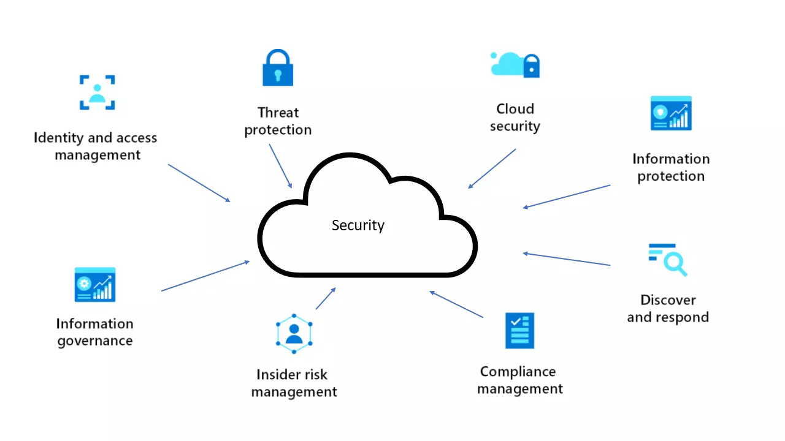

# شروع سفر من با Azure: به اشتراک‌گذاری آموزش‌ها و نکات امنیتی رایگان

من به تازگی وارد دنیای Azure شدم و تصمیم گرفتم که سفر یادگیری‌ام رو با شما به اشتراک بذارم. در این مسیر، تمرکز اصلی من روی یکی از حساس‌ترین موضوعات ابری، یعنی امنیت است.  
آژور برای من یک چالش بزرگ و در عین حال فرصت بی‌نظیر است، چون در دنیای ابری که به سرعت در حال رشد است، امنیت حرف اول رو می‌زنه. به همین دلیل، تصمیم گرفتم که تجربه‌های شخصی خودم رو از این مسیر در قالب نوت‌ها و آموزش‌های رایگان با شما به اشتراک بذارم.

## چرا Azure؟

اگر به دنیای Cloud Computing علاقه‌مندید، احتمالاً نام Azure رو شنیدید. Microsoft Azure به عنوان یکی از قدرتمندترین پلتفرم‌های ابری در دنیا شناخته می‌شه. با این حال، یادگیری آژور به خصوص در زمینه امنیت می‌تونه یک چالش جدی باشه. من هم به عنوان یک تازه‌کار در این حوزه، به دنبال یادگیری هرچه بیشتر و عمیق‌تر این پلتفرم هستم.

## چرا امنیت؟

از همان ابتدا که وارد Azure شدم، متوجه شدم که یکی از چالش‌های اصلی در دنیای Cloud، حفظ امنیت داده‌ها و منابع است. بسیاری از سازمان‌ها به دلیل ضعف‌های امنیتی دچار مشکلات بزرگی می‌شوند و من تصمیم گرفتم که در این زمینه بیشتر مطالعه کنم و به دنبال بهترین شیوه‌ها و راه‌حل‌ها باشم.

هدف من از انتخاب امنیت Azure این است که هم خودم به صورت عمیق‌تر این موضوع رو یاد بگیرم و هم به دیگران کمک کنم تا بهترین و امن‌ترین روش‌ها رو برای پیاده‌سازی سیستم‌های ابری پیدا کنند.

## هدف من از این پست‌ها:

در طول این مسیر یادگیری، به چند هدف اصلی رسیده‌ام:

- **به اشتراک‌گذاری یادداشت‌ها و آموزش‌های خود:** تمام نکات و تجربیاتم از کار با Azure رو با شما به اشتراک می‌گذارم. از چالش‌هایی که با اون‌ها مواجه شدم گرفته تا راه‌حل‌هایی که پیدا کردم.  
- **آموزش رایگان برای همه:** هدف من اینه که آموزش‌های کاربردی و رایگان در زمینه امنیت ابری و Azure به جامعه ارائه بدم. امیدوارم که با این آموزش‌ها، به رشد و پیشرفت جامعه در زمینه Cloud کمک کنم.  
- **آشنایی بیشتر با مفاهیم امنیتی Azure:** امنیت، یکی از اصلی‌ترین موضوعات در فضای ابری است و من قصد دارم که در این زمینه مطالب تخصصی و مفید ارائه بدم.

## چگونه با من همراه شوید؟

من قصد دارم به‌طور منظم پست‌های آموزشی و نکات امنیتی خودم رو در اینجا به اشتراک بذارم. برای شروع، از شما دعوت می‌کنم که اگر سوالی دارید یا تجربه‌ای دارید که می‌خواهید به اشتراک بگذارید، کامنت بگذارید و با من در این سفر یادگیری همراه شوید.

همچنین، اگر علاقه‌مند به دریافت آموزش‌های بیشتر هستید، می‌توانید من رو در سایر پلتفرم‌ها دنبال کنید. در اینجا، به مرور زمان منابع آموزشی و پروژه‌های عملی خودم رو هم به اشتراک می‌گذارم:

- **LinkedIn:** [Alireza Taghikhani](https://www.linkedin.com/in/alireza-taghikhani/)
- **GitHub:** [Azure Certification Cheatsheet](https://github.com/TaghikhaniAlireza/Azure-certification-cheatsheet)

## نتیجه‌گیری:

این تنها آغاز سفر من با Azure است و مطمئناً در آینده نکات بیشتری رو برای شما به اشتراک خواهم گذاشت. امیدوارم که این پست‌ها بتونه به شما در یادگیری Azure و به‌خصوص در زمینه امنیت کمک کنه.  
بیایید با هم به دنیای cloud computing و امنیت آن سفر کنیم.
