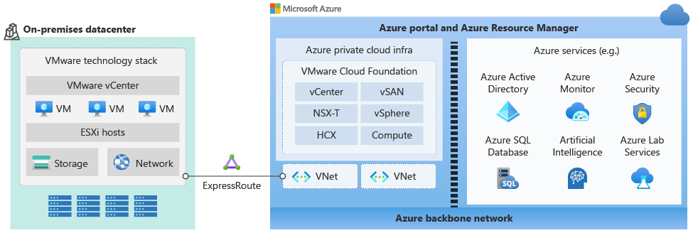

# معرفی Azure VMware Solution

## Azure VMware Solution چیست؟

Azure VMware Solution (یا به‌اختصار AVS) یک سرویس ابری از مایکروسافت است که به سازمان‌ها اجازه می‌دهد زیرساخت‌های VMware خود را **بدون تغییر** و به‌صورت مستقیم روی **زیرساخت اختصاصی Azure** اجرا کنند.

با استفاده از AVS، می‌توانید محیط‌های vSphere، vSAN، NSX و vCenter را در قالب یک کلود خصوصی و کاملاً مدیریت‌شده، در دیتاسنترهای Azure پیاده‌سازی کنید.

---

## ویژگی‌های کلیدی AVS

Azure VMware Solution صرفاً یک محیط VMware در Azure نیست؛ بلکه مجموعه‌ای از ویژگی‌های فنی و عملیاتی را در اختیار سازمان‌ها قرار می‌دهد تا با حفظ ساختار فعلی، بهره‌وری بیشتری در فضای ابری داشته باشند. در این بخش، نگاهی می‌اندازیم به قابلیت‌های شاخص این سرویس که آن را به گزینه‌ای جذاب برای مهاجرت و توسعه زیرساخت تبدیل می‌کند.

- **زیرساخت اختصاصی (Bare-Metal)** در Azure
- شامل نسخه‌های لایسنس‌شده‌ی VMware vCenter, ESXi, vSAN, NSX
- **مدیریت با ابزارهای آشنا** مثل vSphere Client و NSX Manager
- مهاجرت سریع با استفاده از **VMware HCX Enterprise**
- **پشتیبانی مشترک** بین Microsoft و VMware
- امکان اتصال به شبکه‌های داخلی سازمان با **ExpressRoute و VPN**
- سازگاری کامل با سرویس‌های بومی Azure مانند Backup، Monitor و Security Center

---

## چرا Azure VMware Solution؟

در میان گزینه‌های متعدد مهاجرت به فضای ابری، انتخاب راهکار مناسب بسته به شرایط فنی، اهداف سازمانی و منابع در دسترس متفاوت خواهد بود. Azure VMware Solution زمانی انتخاب بهینه است که سازمان نیاز به مهاجرت سریع، 
بدون تغییر ساختار و با حفظ ابزارهای VMware داشته باشد. در این بخش بررسی می‌کنیم که چرا و در چه شرایطی AVS می‌تواند گزینه‌ای هوشمندانه باشد.

| نیاز کسب‌وکار | نقش AVS |
|---------------|----------|
| مهاجرت سریع از دیتاسنتر داخلی | پشتیبانی از Live Migration با HCX |
| کاهش ریسک تغییرات در محیط | حفظ ابزار و فرآیندهای VMware |
| استفاده از ظرفیت ابری بدون بازطراحی | اجرای VMهای فعلی روی Azure |
| کاهش هزینه‌های لایسنس و نگهداری | پشتیبانی از مجوزهای Windows/SQL قبلی |
| افزایش تاب‌آوری سازمان | راه‌اندازی DR Site مبتنی بر AVS |

---

## معماری کلی

Azure VMware Solution یک محیط مجازی‌سازی کامل را روی هاست‌های فیزیکی Azure فراهم می‌کند. هر کلود خصوصی از چندین **کلاستر vSphere** تشکیل شده که روی آن‌ها سرویس‌های زیر اجرا می‌شوند:

- vCenter Server برای مدیریت مرکزی
- VMware ESXi روی هاست‌های Bare-Metal
- NSX-T برای شبکه‌سازی و امنیت
- vSAN برای ذخیره‌سازی اشتراکی با عملکرد بالا

---

## مقایسه Azure VMware Solution با دیگر راهکارهای مهاجرت

در هنگام تصمیم‌گیری برای انتقال زیرساخت از دیتاسنتر داخلی به فضای ابری، انتخاب ابزار یا راهکار مناسب اهمیت زیادی دارد. مایکروسافت چندین گزینه برای مهاجرت ارائه می‌دهد که هرکدام مزایا و محدودیت‌های خاص خود را دارند.
یکی از اصلی‌ترین انتخاب‌ها، مقایسه بین **Azure VMware Solution (AVS)** و **Azure Migrate** است.

---

### Azure VMware Solution vs. Azure Migrate

Azure Migrate راهکاری رایگان از مایکروسافت است که برای ارزیابی، آماده‌سازی و انتقال منابع به Azure طراحی شده است. در مقابل، Azure VMware Solution به سازمان‌ها اجازه می‌دهد بدون تغییر در زیرساخت فعلی VMware خود، ماشین‌های مجازی را به Azure منتقل کرده و همان ابزارهای مدیریتی را حفظ کنند.

| ویژگی                      | Azure VMware Solution (AVS)           | Azure Migrate                            |
|---------------------------|----------------------------------------|-------------------------------------------|
| نوع مهاجرت                | Lift & Shift کامل بدون تغییر           | مهاجرت تدریجی با نیاز به تغییرات         |
| محیط مقصد                | VMware vSphere روی Azure               | ماشین مجازی native در Azure              |
| نیاز به بازطراحی         | ❌ ندارد                               | ✅ معمولاً نیاز دارد                      |
| ابزار مدیریت             | vSphere Client، NSX Manager           | Azure Portal، Azure CLI                   |
| سازگاری با ابزارهای VMware | ✅ کامل                               | ❌ ندارد                                   |
| پیچیدگی راه‌اندازی       | متوسط تا بالا                         | پایین تا متوسط                           |
| مناسب برای               | مهاجرت سریع دیتاسنتر بدون بازنویسی   | مهاجرت تدریجی اپلیکیشن‌ها                |

**جمع‌بندی**:  
اگر سازمان شما به‌دنبال انتقال سریع ماشین‌های مجازی موجود به Azure بدون بازطراحی است، AVS گزینه‌ی ایده‌آلی است.  
اما اگر قصد بازطراحی اپلیکیشن‌ها یا استفاده از سرویس‌های بومی Azure را دارید، Azure Migrate مناسب‌تر خواهد بود.

---

### AVS در مقایسه با VMware Cloud on AWS

در نگاه اول، Azure VMware Solution و VMware Cloud on AWS مشابه به‌نظر می‌رسند. هر دو این سرویس‌ها امکان اجرای بارهای کاری VMware در فضای ابری را فراهم می‌کنند. اما تفاوت‌های مهمی بین این دو راهکار وجود دارد که در جدول زیر بررسی شده است:

| ویژگی | Azure VMware Solution | VMware Cloud on AWS |
|--------|------------------------|----------------------|
| ارائه‌دهنده | Microsoft + VMware | AWS + VMware |
| منطقه‌های جغرافیایی | گسترده در Azure Regions | کمتر از Azure |
| مدل پشتیبانی | Microsoft + VMware | VMware |
| اتصال به خدمات ابری بومی | عمیق با Azure Services | عمیق با AWS Services |
| ادغام با مجوزهای Microsoft (Windows, SQL) | ✅ دارد | ❌ ندارد |
| گزینه‌ی مقرون‌به‌صرفه برای مشتریان Microsoft | ✅ بله | ❌ معمولاً خیر |

---

### نکته کلیدی

AVS به طور خاص برای سازمان‌هایی طراحی شده که:
- **قبلاً سرمایه‌گذاری زیادی در VMware داشته‌اند**
- نمی‌خواهند ابزار مدیریت و زیرساخت‌های خود را عوض کنند
- می‌خواهند از قدرت Azure در کنار آشنایی با vSphere بهره ببرند

در بخش بعدی، یک سناریوی واقعی از استفاده‌ی AVS را بررسی می‌کنیم.

---

## گام بعدی چیست؟

در بخش‌های بعدی به بررسی دقیق‌تر معماری، نحوه استقرار، امنیت، مهاجرت و سناریوهای کاربردی AVS خواهیم پرداخت.

🔗 ادامه مطلب: [معماری و اجزای AVS](architecture.md)

